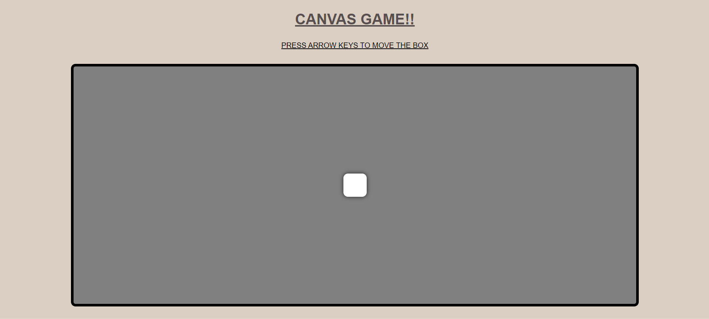

# 🎮 CANVAS GAME

## Description

This project is a simple web-based game where a box moves within a defined container based on keyboard arrow key presses. The box smoothly animates its movement using CSS transitions and JavaScript. 🎉

## Game-Preview



## Technologies Used

- **HTML**: For structuring the web page. 🌐
- **CSS**: For styling the elements and creating a visually appealing layout. 🎨
- **JavaScript**: For handling user input and animating the movement of the box. ⚙️

## Features

- Box movement controlled by the arrow keys (up, down, left, right). ⬆️⬇️⬅️➡️
- Smooth animations when the box moves within the container. ✨
- Prevents the box from moving outside the container's borders. 🚫
- Responsive design that adapts to different screen sizes. 📱💻

## Getting Started

### Prerequisites

- A modern web browser (e.g., Chrome, Firefox, Safari). 🌟
- Basic understanding of HTML, CSS, and JavaScript (optional, for modification). 📚

### Installation

1. **Clone the repository**:
   ```bash
   git clone <repo-url>
   cd canvas-game
   ```

2. **Open the HTML file**:
   Open `index.html` in your web browser to start the game. 🚀

### Usage

- Use the **arrow keys** on your keyboard to move the box around the container. ⌨️
- The box will smoothly animate its movement and stop at the container's borders. 🎈

## Code Structure

- **index.html**: The main HTML file containing the structure of the game. 📄
- **style.css**: The CSS file for styling the container and the box. ✏️
- **script.js**: The JavaScript file for handling the key presses and moving the box. 📜

## Example

Here's a preview of the project structure:

```
canvas-game/
│
├── index.html
├── style.css
└── script.js
```


